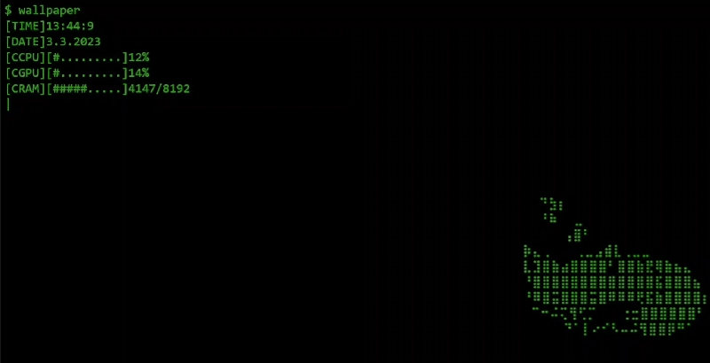

<h1 align="center">Livewallpaper Console</h1>
<h3 align="center">This is a minimalistic desktop wallpaper in console style, which is launched using the Lively Wallpaper application. Do not take this project seriously, it was written to explore the capabilities of the application and includes only basic functionality. Perhaps it will be useful to someone as an example.😉</h3>
<h1 align="center">Demonstration</h1>

<h1 align="center">Installing</h1>

If you really liked the wallpaper and you decided to install it, then follow the instructions below, you can do it.

1. Open [this](https://github.com/rocksdanister/lively) page, familiarize yourself with the options for installing Lively Wallpaper and install it in any way convenient for you.
2. Download it' `.zip` archive at [this](https://github.com/Belyanchik/liveWallpaper-console/releases/download/download_this/liveWallpaper_Console.zip) link
3. Click `Add Wallpapers` and drag the archive to the area that appears
